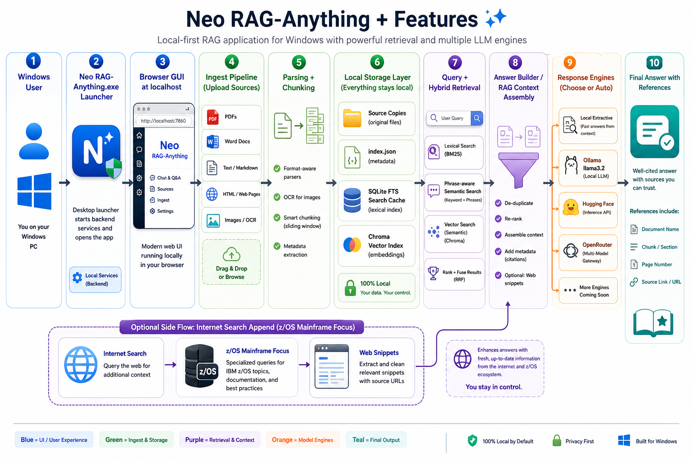

# Neo RAG-Anything

Neo RAG-Anything is a local Windows document RAG app with a browser GUI, native launcher, upload indexing, hybrid search, and optional model-based answer writing.

## Distribution And Permission

Neo RAG-Anything is proprietary software. The public GitHub repository is intended for release downloads only.

You may download and use the official Windows release ZIP. You may not copy, rebuild, recreate, modify, redistribute, reverse engineer, publish derivative works from, or reuse the code, binaries, documentation, artwork, or related assets without prior written permission from the copyright owner.

Use of the code or assets outside the official release package requires separate written permission.



## Quick Start

Download the official Windows ZIP from the GitHub release page, extract it, then use the native launcher below.

### Option 1: Native Launcher

Run:

```text
Neo RAG-Anything.exe
```

The launcher has:

- **Start**: starts the local GUI service and opens the browser.
- **Restart**: stops and starts the service again.
- **Stop**: stops the local GUI service.
- **Open GUI**: opens the browser at `http://127.0.0.1:7860`.

Closing the launcher stops the GUI service.

## Windows ZIP Release

The ready-to-use Windows package is:

```text
Neo-RAG-Anything-Windows.zip
```

Download it from:

```text
https://github.com/diazneoones82/Neo-RAG-Anything/releases/tag/v1.0.0
```

To use it on a Windows desktop:

1. Download the ZIP.
2. Extract it to a normal folder, for example `C:\Tools\Neo RAG-Anything`.
3. Run `Neo RAG-Anything.exe`.
4. Click **Start**.
5. Click **Open GUI** if the browser does not open automatically.
6. Open `http://127.0.0.1:7860` in the browser.

The app stores indexed documents outside the program folder by default:

```text
%LOCALAPPDATA%\NeoRAGAnything\store
```

You can change this from the GUI with **Storage folder** and **Save**.

## Upload And Index

1. Open the GUI.
2. Set **Storage folder** if you want chunks and source files stored somewhere specific, such as `D:\RAGData`.
3. Click **Save**.
4. Drop files into the upload box, click **Choose Files**, or click **Choose Folder** to ingest a whole folder.
5. Watch the ingest progress bar for the current file, completed count, and skipped-file warnings.

Uploads use multipart file transfer, so large PDFs are sent as files instead of being converted into huge browser strings. Folder ingest sends files one at a time so large PDF folders show steady progress and do not stall as one oversized browser request.

You can also ingest web content from the same area:

- **Ingest Web Page**: enter a full `http://` or `https://` page URL and index that page as a saved HTML source.
- **Ingest Web Category**: enter a category/archive URL and the app crawls paginated category pages, collects article links from the same site, and indexes every discovered article page.
- **Max pages** limits how many category/archive pages the crawler visits before it stops.
- **Threads** controls how many discovered article pages download at the same time. Start around `8` to `12`; reduce it if a site rate-limits or blocks automated requests.

Category ingestion uses parallel page downloads for speed, then writes the successful pages to `index.json`, SQLite FTS, and ChromaDB as a single batch. Retrieved references open the original web URL and the chunk text.

Supported files:

- PDF
- Word `.docx`
- legacy `.doc` if LibreOffice is installed
- text and Markdown
- HTML web pages
- common image files

## Export And Import Ingest Data

Use these controls near the ingest area:

- **Export Ingest ZIP**: downloads a zip containing the active storage folder, including source files, chunks, and `index.json`.
- **Import Ingest ZIP**: uploads an exported zip and replaces the current index in the active storage folder.

This uses built-in zip handling. No external archive tool is required.

Do not upload exported ingest ZIPs to a public repository unless you are sure the source documents and chunks are safe to publish.

## Chunking Options

- **Recursive**: best default for mixed documents.
- **Paragraph**: good for clean text.
- **Fixed**: predictable chunk lengths for manuals.

## Search Mode

- **Hybrid**: lexical keyword ranking plus lightweight semantic similarity, fused with reciprocal-rank fusion.
- **Lexical**: BM25-style keyword ranking.
- **Semantic**: full-phrase-aware local token and phrase similarity ranking.

Hybrid is the recommended default.

For command/manual lookups such as `SETCON command`, keep **Prefer exact phrase / command matches** enabled. This boosts exact normalized phrases, ordered token proximity, and command-like tokens before broad semantic/vector ranking. Turn it off when you want wider conceptual discovery instead of closest string matches.

## Search Cache

Neo RAG-Anything creates a local SQLite full-text cache for faster chunk lookup:

```text
<storage folder>\search_cache.sqlite
```

The cache uses SQLite FTS search with BM25-style ranking, so keyword and phrase-heavy queries do not need to scan every chunk in Python. The app validates the cache against `index.json`; if the JSON changes or an older ingest ZIP is imported, the cache rebuilds automatically on the next search. New ingests update the cache automatically.

The GUI shows:

```text
Search cache: SQLite FTS active
```

If SQLite FTS is unavailable on a machine, the app falls back to the built-in local scanner.

## Vector Index

Neo RAG-Anything uses ChromaDB when the `chromadb` package is available. The vector store is saved under the active storage folder:

```text
<storage folder>\chroma
```

The app writes vectors for every chunk with metadata including document name, document id, chunk number, page, and extension. Hybrid search uses lexical ranking, phrase-aware semantic ranking, and Chroma vector ranking together. If ChromaDB is unavailable, the app keeps working with local lexical/semantic retrieval and shows `Vector index: local fallback`.

Use **Use Chroma vector search in Hybrid** to enable or disable Chroma per query. When it is unchecked, Hybrid uses only lexical plus phrase-aware semantic search from `index.json`.

Use **Rebuild Vector Index** after importing an older ingest ZIP or after upgrading an existing JSON-only index. New document ingests write vectors automatically.

The **Export Ingest ZIP** and **Import Ingest ZIP** controls include the `chroma` folder automatically because it lives inside the active storage folder.

## Internet Results

When **Append internet results after local RAG answer** is enabled, the app searches public web results after local chunk retrieval. It tries multiple no-key providers in order: DuckDuckGo, Bing, then Google standard search fallback. If a provider blocks automated result HTML, the app moves to the next fallback. Hugging Face and OpenRouter still receive returned web snippets as extra context, and the visible answer also appends an **Internet results** section at the end.

Enable **Focus internet search for z/OS Mainframe** when your question is about z/OS or mainframe content. The app keeps the full query text, adds strict z/OS/Mainframe/IBM context, and uses exact command variants for command-style questions.

For command-style questions such as `setxcf start,reallocate`, the focused search uses exact quoted command variants, prefers IBM documentation oriented queries, and tries Google/DuckDuckGo before Bing so generic web results are less likely to dominate.

## Asking Questions

- Press **Enter** to ask.
- Press **Shift+Enter** for a new line.
- Increase or decrease **Contexts** to control how many chunks are used. The default is `15`, max is `20`.

Every answer includes **References used**, showing:

- document name
- chunk number
- PDF page when available
- source link
- chunk text link

## Response Engines

### Local Extractive

Uses retrieved chunks only. No API token or internet model is required.

### Ollama

Uses a local Ollama model. Example:

```powershell
ollama pull llama3.2
ollama serve
```

Then choose `Ollama` and set the model field to `llama3.2`.

### Hugging Face

Choose `Hugging Face`, select a preset, paste your token, and click **Save HF**.

The UI shows when a saved token is loaded:

```text
Saved tokens loaded already: Hugging Face
```

### OpenRouter

Choose `OpenRouter`. The default model is:

```text
poolside/laguna-m.1-20260312:free
```

Available OpenRouter presets include:

- `poolside/laguna-m.1-20260312:free`
- `openrouter/free`
- `openai/gpt-oss-20b:free`
- `nvidia/nemotron-nano-9b-v2:free`
- `liquid/lfm-2.5-1.2b-instruct-20260120:free`
- `z-ai/glm-4.5-air:free`

When `openrouter/free` is selected, the app tries only this free-route sequence:

1. `openai/gpt-oss-20b:free`
2. `liquid/lfm-2.5-1.2b-instruct-20260120:free`
3. `nvidia/nemotron-nano-9b-v2:free`
4. `nvidia/nemotron-nano-9b-v2:free`
5. `z-ai/glm-4.5-air:free`

Paste your OpenRouter key into **OpenRouter token** and click **Save OR**.

The UI shows when saved tokens are loaded:

```text
Saved tokens loaded already: Hugging Face, OpenRouter
```

## Internet Search

Enable **Search internet after local RAG retrieval** to add a public web cross-check after local chunk retrieval.

- Local mode shows local RAG answer plus web snippets.
- Hugging Face and OpenRouter modes can use the retrieved chunks plus web snippets.
- If no web result is returned, the answer remains based on local RAG chunks.

## Saved Settings

Settings are saved locally:

```text
%LOCALAPPDATA%\NeoRAGAnything\config.json
```

Saved settings can include:

- storage folder
- Hugging Face token
- OpenRouter token

Tokens are not included in the release ZIP or source repository. The app only saves tokens locally after you enter them in the GUI and click **Save HF** or **Save OR**.

## Large Ingest Indexes

Large test indexes should not be committed to GitHub. A 4.7 GB ingest folder is too large for a normal repository and may contain private document text.

Recommended options:

- **Best for private use**: keep the ingest folder on local disk or a shared drive, then point **Storage folder** to it.
- **Best for moving to another PC**: use **Export Ingest ZIP** and transfer it through OneDrive, Google Drive, SharePoint, S3, or another file-share system.
- **Best for team distribution**: publish the ingest ZIP as a separate GitHub Release asset only if the documents are approved for sharing. Do not commit it into the repo.
- **Best for very large indexes**: keep source PDFs/docs in cloud storage and rebuild the index on each target machine, or split exports by document set.

The portable ingest data can include:

- `index.json`
- `search_cache.sqlite`
- `chroma`
- source document copies

For a 4.7 GB index, the safest pattern is to store it outside the app repo and document the download location. Keep only the app ZIP and source code in GitHub.

## Build

To build the native launcher EXE:

```powershell
powershell -ExecutionPolicy Bypass -File .\build_launcher.ps1
```

Output:

```text
dist\Neo RAG-Anything.exe
```

## Troubleshooting

If the browser cannot reach the GUI:

1. Open the launcher.
2. Click **Restart**.
3. Click **Open GUI**.

If port `7860` is busy:

```powershell
$env:RAG_WEBUI_PORT="7861"
powershell -ExecutionPolicy Bypass -File .\run_webui.ps1
```

Then open:

```text
http://127.0.0.1:7861
```
